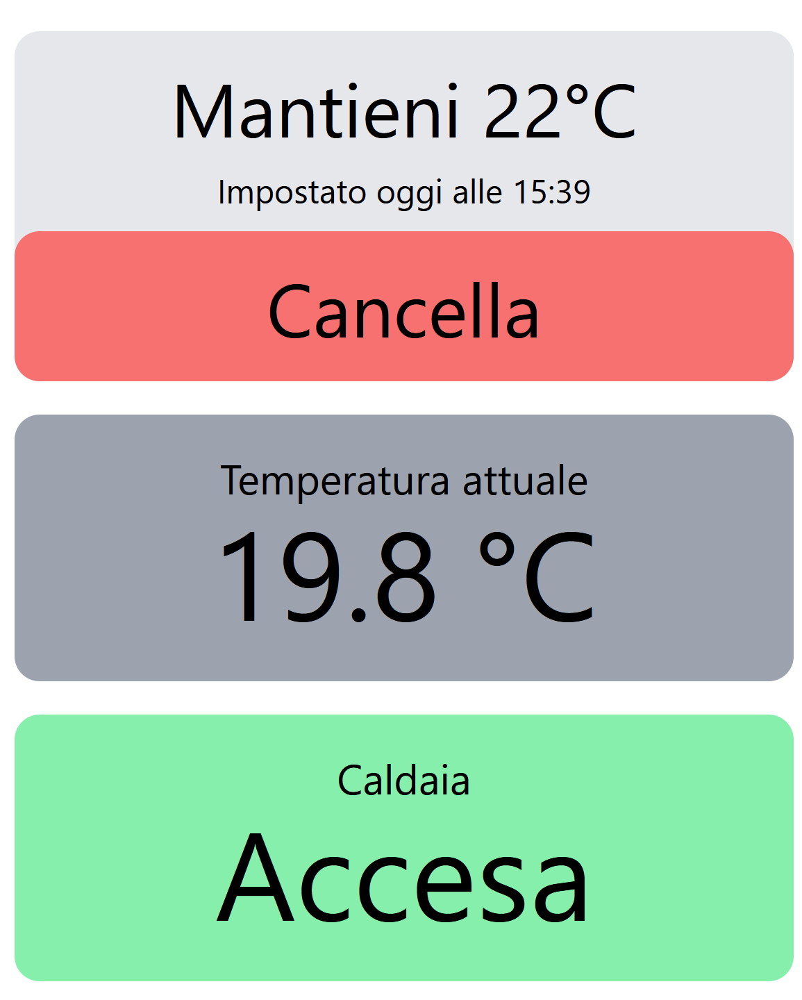
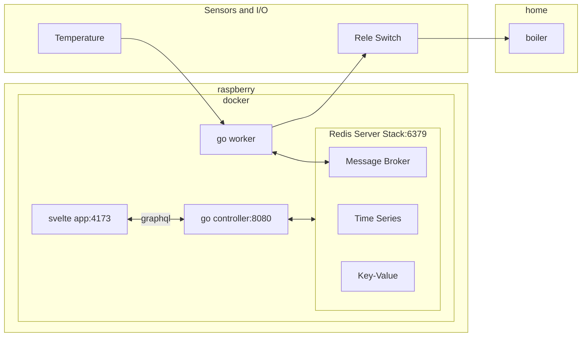

# stupid-caldaia

Caldaia means boiler.

Since my boiler is old and stupid, I decided to make it smart, but not too much.

Plus one can learn go, which is pretty cool.

# Interface

The front-end is pretty simple. There is a button to set a quick rule to control the boiler. A center preview of the current temperature and the current state of the boiler. Below a plot of the temperature in the last 24 hours.



# Architecture

The front-end is a svelte app that communicates with a go back-end (controller) in graphql, both via streams and requests. The communication between worker and controller happens via redis message broker. All data is also stored in redis.

The app, the controller and the worker are all dockerized and running on a raspberry pi zero 2w.

Following a diagram of the deployment:



# Flash raspberry

Insert sd card and run and bypass windows to connect USB to WSL2 (you have to build the kernel with SD and USB drivers first)

```powershell
usbip list -l
```

```powershell
usbipd attach --wsl --busid 1-1
```

```bash
lsblk

>>> OK
sdd      8:48   1  59.5G  0 disk
├─sdd1   8:49   1   256M  0 part
└─sdd2   8:50   1  59.2G  0 part
```

```bash
sudo rpi-imager
```
